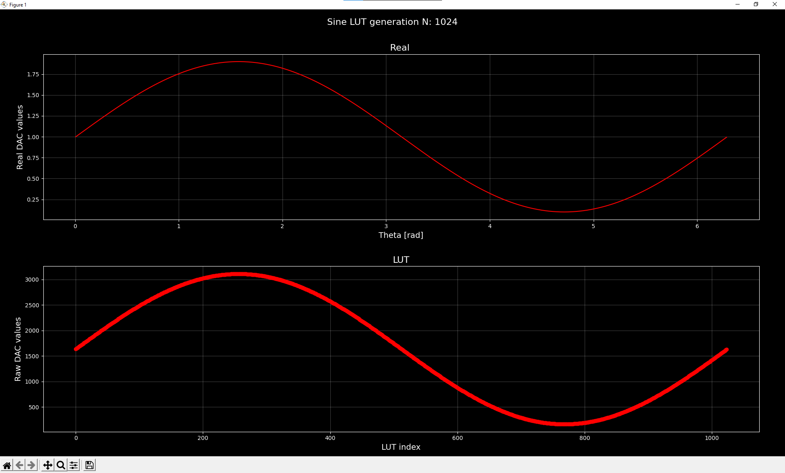

# **Sine LUT Generator**
This repository contains python script for generation of sine LUT for C language for general embedded applications use. 

## **Script Configurations**

Setup sine LUT generator by the needs of the application. Following configuration are example of using 12-bit DAC with 2.5V reference. Generated sine will have a 1V of DC-offset and 0.9V amplitude.

```Python
# Number of elements in LUT
N = 1024

# DAC resolution ( in bits )
DAC_RES = 12	

# DAC Vref
DAC_VREF = 2.5  #V

# Sine DC offset
SIN_DC = 1.0    # V

# Sine amplitude
SIN_AMP = 0.9   # V

# Sine phase
SIN_PHASE = 0 # rad
```

## **Outputs**
Example of generated sine LUT with above configurations:



And the C code in output file ***sin_lut.txt***:
```C
/**
 *    Sine LUT table
 *
 * @note   This table is automatically generated with a help of
 *         sine_lut_gen.py python script version V0.1.0
 *
 *         Script can be found under /utils directory
 *
 *     Size of LUT in bytes: 2048
 *
 *     Generated sine signal property:
 *       - DC-offset = 1.0 V
 *       - Amplitude = 0.9 V
 *       - Phase = 0 rad
 */
const uint16_t gu16_sin_lut[1024] = {
    1638, 1647, 1656, 1665, 1674, 1683, 1692, 1701, 1710, 1719, 1728, 1737, 1746, 1755, 1764, 1773, 
    1782, 1791, 1800, 1809, 1818, 1827, 1836, 1845, 1854, 1863, 1872, 1881, 1890, 1898, 1907, 1916, 
    1925, 1934, 1943, 1952, 1960, 1969, 1978, 1987, 1996, 2004, 2013, 2022, 2031, 2039, 2048, 2057, 
    2065, 2074, 2083, 2091, 2100, 2109, 2117, 2126, 2134, 2143, 2151, 2160, 2168, 2176, 2185, 2193, 
    2202, 2210, 2218, 2227, 2235, 2243, 2251, 2260, 2268, 2276, 2284, 2292, 2300, 2308, 2316, 2324, 
    2332, 2340, 2348, 2356, 2364, 2372, 2380, 2388, 2395, 2403, 2411, 2419, 2426, 2434, 2441, 2449, 
    2457, 2464, 2472, 2479, 2486, 2494, 2501, 2508, 2516, 2523, 2530, 2537, 2544, 2552, 2559, 2566, 
    2573, 2580, 2587, 2594, 2600, 2607, 2614, 2621, 2628, 2634, 2641, 2647, 2654, 2661, 2667, 2674, 
    2680, 2686, 2693, 2699, 2705, 2711, 2718, 2724, 2730, 2736, 2742, 2748, 2754, 2760, 2766, 2771, 
    2777, 2783, 2788, 2794, 2800, 2805, 2811, 2816, 2822, 2827, 2832, 2838, 2843, 2848, 2853, 2858, 
    2863, 2868, 2873, 2878, 2883, 2888, 2893, 2897, 2902, 2907, 2911, 2916, 2920, 2925, 2929, 2933, 
    2938, 2942, 2946, 2950, 2954, 2958, 2962, 2966, 2970, 2974, 2978, 2982, 2985, 2989, 2992, 2996, 
    2999, 3003, 3006, 3010, 3013, 3016, 3019, 3022, 3026, 3029, 3032, 3034, 3037, 3040, 3043, 3046, 
    3048, 3051, 3053, 3056, 3058, 3061, 3063, 3065, 3068, 3070, 3072, 3074, 3076, 3078, 3080, 3082, 
    3083, 3085, 3087, 3088, 3090, 3092, 3093, 3094, 3096, 3097, 3098, 3099, 3101, 3102, 3103, 3104, 
    3105, 3105, 3106, 3107, 3108, 3108, 3109, 3109, 3110, 3110, 3111, 3111, 3111, 3111, 3112, 3112, 
    3112, 3112, 3112, 3111, 3111, 3111, 3111, 3110, 3110, 3109, 3109, 3108, 3108, 3107, 3106, 3105, 
    3105, 3104, 3103, 3102, 3101, 3099, 3098, 3097, 3096, 3094, 3093, 3092, 3090, 3088, 3087, 3085, 
    3083, 3082, 3080, 3078, 3076, 3074, 3072, 3070, 3068, 3065, 3063, 3061, 3058, 3056, 3053, 3051, 
    3048, 3046, 3043, 3040, 3037, 3034, 3032, 3029, 3026, 3022, 3019, 3016, 3013, 3010, 3006, 3003, 
    2999, 2996, 2992, 2989, 2985, 2982, 2978, 2974, 2970, 2966, 2962, 2958, 2954, 2950, 2946, 2942, 
    2938, 2933, 2929, 2925, 2920, 2916, 2911, 2907, 2902, 2897, 2893, 2888, 2883, 2878, 2873, 2868, 
    2863, 2858, 2853, 2848, 2843, 2838, 2832, 2827, 2822, 2816, 2811, 2805, 2800, 2794, 2788, 2783, 
    2777, 2771, 2766, 2760, 2754, 2748, 2742, 2736, 2730, 2724, 2718, 2711, 2705, 2699, 2693, 2686, 
    2680, 2674, 2667, 2661, 2654, 2647, 2641, 2634, 2628, 2621, 2614, 2607, 2600, 2594, 2587, 2580, 
    2573, 2566, 2559, 2552, 2544, 2537, 2530, 2523, 2516, 2508, 2501, 2494, 2486, 2479, 2472, 2464, 
    2457, 2449, 2441, 2434, 2426, 2419, 2411, 2403, 2395, 2388, 2380, 2372, 2364, 2356, 2348, 2340, 
    2332, 2324, 2316, 2308, 2300, 2292, 2284, 2276, 2268, 2260, 2251, 2243, 2235, 2227, 2218, 2210, 
    2202, 2193, 2185, 2176, 2168, 2160, 2151, 2143, 2134, 2126, 2117, 2109, 2100, 2091, 2083, 2074, 
    2065, 2057, 2048, 2039, 2031, 2022, 2013, 2004, 1996, 1987, 1978, 1969, 1960, 1952, 1943, 1934, 
    1925, 1916, 1907, 1898, 1890, 1881, 1872, 1863, 1854, 1845, 1836, 1827, 1818, 1809, 1800, 1791, 
    1782, 1773, 1764, 1755, 1746, 1737, 1728, 1719, 1710, 1701, 1692, 1683, 1674, 1665, 1656, 1647, 
    1637, 1628, 1619, 1610, 1601, 1592, 1583, 1574, 1565, 1556, 1547, 1538, 1529, 1520, 1511, 1502, 
    1493, 1484, 1475, 1466, 1457, 1448, 1439, 1430, 1421, 1412, 1403, 1394, 1385, 1377, 1368, 1359, 
    1350, 1341, 1332, 1323, 1315, 1306, 1297, 1288, 1279, 1271, 1262, 1253, 1244, 1236, 1227, 1218, 
    1210, 1201, 1192, 1184, 1175, 1166, 1158, 1149, 1141, 1132, 1124, 1115, 1107, 1099, 1090, 1082, 
    1073, 1065, 1057, 1048, 1040, 1032, 1024, 1015, 1007, 999, 991, 983, 975, 967, 959, 951, 
    943, 935, 927, 919, 911, 903, 895, 887, 880, 872, 864, 856, 849, 841, 834, 826, 
    818, 811, 803, 796, 789, 781, 774, 767, 759, 752, 745, 738, 731, 723, 716, 709, 
    702, 695, 688, 681, 675, 668, 661, 654, 647, 641, 634, 628, 621, 614, 608, 601, 
    595, 589, 582, 576, 570, 564, 557, 551, 545, 539, 533, 527, 521, 515, 509, 504, 
    498, 492, 487, 481, 475, 470, 464, 459, 453, 448, 443, 437, 432, 427, 422, 417, 
    412, 407, 402, 397, 392, 387, 382, 378, 373, 368, 364, 359, 355, 350, 346, 342, 
    337, 333, 329, 325, 321, 317, 313, 309, 305, 301, 297, 293, 290, 286, 283, 279, 
    276, 272, 269, 265, 262, 259, 256, 253, 249, 246, 243, 241, 238, 235, 232, 229, 
    227, 224, 222, 219, 217, 214, 212, 210, 207, 205, 203, 201, 199, 197, 195, 193, 
    192, 190, 188, 187, 185, 183, 182, 181, 179, 178, 177, 176, 174, 173, 172, 171, 
    170, 170, 169, 168, 167, 167, 166, 166, 165, 165, 164, 164, 164, 164, 163, 163, 
    163, 163, 163, 164, 164, 164, 164, 165, 165, 166, 166, 167, 167, 168, 169, 170, 
    170, 171, 172, 173, 174, 176, 177, 178, 179, 181, 182, 183, 185, 187, 188, 190, 
    192, 193, 195, 197, 199, 201, 203, 205, 207, 210, 212, 214, 217, 219, 222, 224, 
    227, 229, 232, 235, 238, 241, 243, 246, 249, 253, 256, 259, 262, 265, 269, 272, 
    276, 279, 283, 286, 290, 293, 297, 301, 305, 309, 313, 317, 321, 325, 329, 333, 
    337, 342, 346, 350, 355, 359, 364, 368, 373, 378, 382, 387, 392, 397, 402, 407, 
    412, 417, 422, 427, 432, 437, 443, 448, 453, 459, 464, 470, 475, 481, 487, 492, 
    498, 504, 509, 515, 521, 527, 533, 539, 545, 551, 557, 564, 570, 576, 582, 589, 
    595, 601, 608, 614, 621, 628, 634, 641, 647, 654, 661, 668, 675, 681, 688, 695, 
    702, 709, 716, 723, 731, 738, 745, 752, 759, 767, 774, 781, 789, 796, 803, 811, 
    818, 826, 834, 841, 849, 856, 864, 872, 880, 887, 895, 903, 911, 919, 927, 935, 
    943, 951, 959, 967, 975, 983, 991, 999, 1007, 1015, 1024, 1032, 1040, 1048, 1057, 1065, 
    1073, 1082, 1090, 1099, 1107, 1115, 1124, 1132, 1141, 1149, 1158, 1166, 1175, 1184, 1192, 1201, 
    1210, 1218, 1227, 1236, 1244, 1253, 1262, 1271, 1279, 1288, 1297, 1306, 1315, 1323, 1332, 1341, 
    1350, 1359, 1368, 1377, 1385, 1394, 1403, 1412, 1421, 1430, 1439, 1448, 1457, 1466, 1475, 1484, 
    1493, 1502, 1511, 1520, 1529, 1538, 1547, 1556, 1565, 1574, 1583, 1592, 1601, 1610, 1619, 1628 
};
```


## **Real life application usage**

Following example shows how generated sine LUT can be used to generate sine and cosine signals. Input to shown function below is angle in signed 16-bit form. Sine LUT is stored in ***gu16_sin_lut[]*** table. At the end values from sine LUT is being set to DAC periphery to generate voltage on microprocessor pin.

```C
////////////////////////////////////////////////////////////////////////////////
/**
*		Sin/Cos generation handler
*
*		Complete function exe.time (-Ofast): 90 us
*
* @param[in] 	theta_req	- Requested angle to generate
* @return 		status 		- Status of operation
*/
////////////////////////////////////////////////////////////////////////////////
__RAM_FUNC__ sin_cos_status_t sin_cos_hndl(const int16_t theta_req_raw)
{
	sin_cos_status_t 	status 		= eSIN_COS_OK;
	uint16_t 			sin_index	= 0;
	uint16_t 			cos_index	= 0;

	// Divide by 64 as having 1024 samples in LUT and input is 16-bit angle
	// Add half of the LUT size as LUT is being generated in negative wave
	sin_index = (( theta_req_raw >> 6 ) + SIN_COS_LUT_SIZE_HALF );

	// Phase offset for 1/4 of the size in LUT
	cos_index = ( sin_index + SIN_COS_LUT_SIZE_FOURTH );

	// Wrap
	if (cos_index >= SIN_COS_LUT_SIZE)
	{
		cos_index -= SIN_COS_LUT_SIZE;
	}

	// Store values
	g_sin_cos.sin = gu16_sin_lut[sin_index];
	g_sin_cos.cos = gu16_sin_lut[cos_index];

	// Update DACs
	dac_set_raw( eDAC_CH_SIN, g_sin_cos.sin );
	dac_set_raw( eDAC_CH_COS, g_sin_cos.cos );

	return status;
}
```
